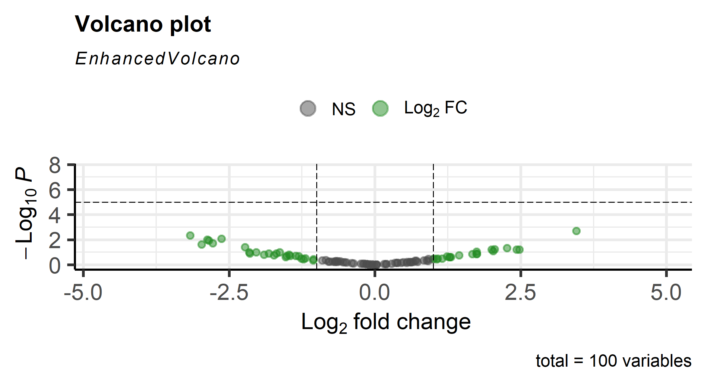

# RNA-seq-basic-analysis

空间组学与DNA修复：RStudio-RNA seq analysis

**🧬 Basic RNA-seq Analysis (Beginner Project)**

**📌 Project Overview**

This project demonstrates a basic RNA-seq differential expression analysis using simulated data.

The goal is to:

Understand the workflow of RNA-seq analysis

Learn how to use DESeq2

Generate and interpret a volcano plot

**🧠 Step-by-Step Explanation (with code)**

**🔹 Step 1: Generate simulated RNA-seq data**

set.seed(1)

countData <- matrix(rnbinom(600, mu=100, size=1), ncol=6)
rownames(countData) <- paste0("Gene", 1:100)
colnames(countData) <- c("Ctrl1","Ctrl2","Ctrl3","Treat1","Treat2","Treat3")

condition <- factor(c("Control","Control","Control","Treatment","Treatment","Treatment"))
colData <- data.frame(row.names=colnames(countData), condition)

👉 模拟一个RNA-seq实验的数据

🔬 关键概念

countData = 基因表达矩阵

行 = 基因（Gene1, Gene2...）

列 = 样本（Ctrl / Treatment）

🧪 实验设计

样本	    分组

Ctrl1-3	  对照组

Treat1-3	处理组

本质：假装做一个“有无DNA damage处理”的实验

**🔹 Step 2: Build DESeq2 dataset**

dds <- DESeqDataSetFromMatrix(
  countData = countData,
  colData = colData,
  design = ~ condition
)

这一步是在告诉电脑：“我要比较 Control vs Treatment”

🔬 关键点
design = ~ condition

意思是：我们关心的变量是“处理 vs 对照”

**🔹 Step 3: Run differential expression analysis**

dds <- DESeq(dds)
res <- results(dds)

👉 这是整个项目最核心的一步

电脑在做什么？

🔬 实际发生的事情：

标准化数据（不同样本测序深度不同）

估计每个基因的波动（dispersions）

统计检验（哪些基因真的变了）

最终输出：哪些基因在Treatment中上调或下调

**🔹 Step 4: View results**

head(res)

列名	          含义

log2FoldChange	表达变化倍数

pvalue	        是否显著

padj	          校正后的p值

👉 最重要两个：

📊 log2FoldChange

> 0 → 上调

< 0 → 下调

📊 pvalue / padj

小 → 显著

大 → 不显著

**🔹 Step 5: Volcano plot visualization**

library(EnhancedVolcano)

EnhancedVolcano(res,
  lab = rownames(res),
  x = 'log2FoldChange',
  y = 'pvalue')

**👉 Volcano plot = 一张“筛选差异基因”的图**

📊 横轴（x轴）👉 log2FoldChange→ 表达变化大小

📊 纵轴（y轴）👉 -log10(pvalue)→ 显著性

左边：下调基因

右边：上调基因

上面：显著

🔥 左上 + 右上 = 最重要基因

📊 Results

**👉 Example volcano plot:**

**What I Learned**

Basic RNA-seq workflow

Differential expression analysis using DESeq2

Interpretation of volcano plots

Understanding gene expression changes

**Skills Demonstrated**

RNA-seq data handling

Statistical analysis (DESeq2)

Data visualization

Basic R programming
